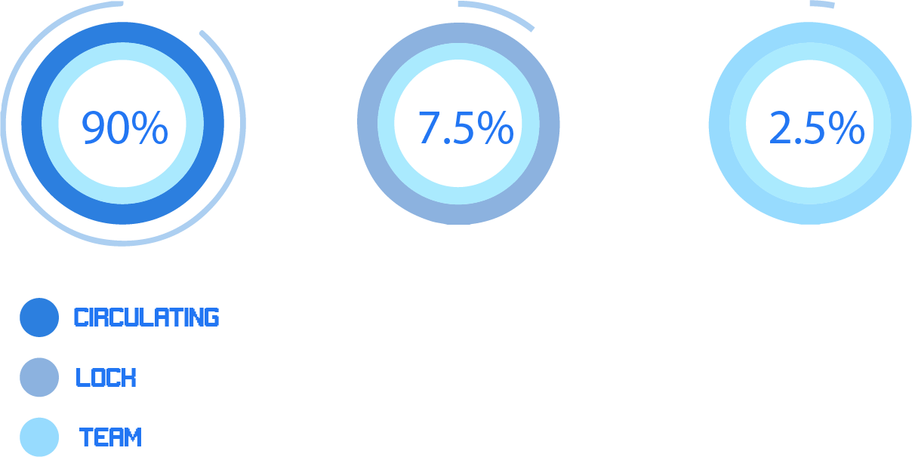

# Tokenomics

LeiaVerse's tokenomics revolves around Leia, the core of this dynamic ecosystem. As a representation of the framework, Leia drives innovation and collaboration, with a token allocated to support her growth and reward meaningful contributions.

<figure><figcaption></figcaption></figure>

## 1. Circulating Supply

90% is the circulating supply&#x20;

## 2. Locked Supply

7.5% is the locked supply

## 3.Team Allocation

2.5% for the team

